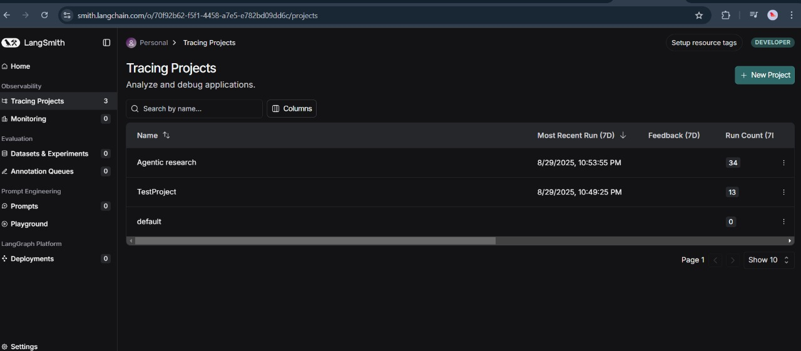

# 🔍 Agentic Research Engine

This project demonstrates a powerful Agentic Research Engine built using the LangChain and LangGraph frameworks. It showcases how to orchestrate specialized AI agents to perform complex, multi-step tasks like web research and information synthesis, offering a robust and transparent approach to automated knowledge gathering.

# 🌟 Project Overview

This project is a practical demonstration of building and managing advanced AI agent workflows. It focuses on breaking down complex research tasks into manageable steps handled by different specialized agents, providing a foundation for more sophisticated AI applications.


# ✨ Key Features
Multi-Agent Architecture: Implements a system with distinct AI agents (e.g., a "Researcher" and a "Writer") that collaborate to achieve a common goal.

1. Automated Web Research: Utilizes tools to perform targeted web searches and gather relevant information based on user queries.

2. Information Synthesis: Agents process raw research data to provide concise summaries and structured reports.

3. Workflow Orchestration with LangGraph: Leverages LangGraph to define and manage the stateful flow between different agents, ensuring controlled and reliable execution.

4. Debugging & Observability: Integrates LangSmith for real-time tracing and monitoring of agent actions and tool calls, aiding in debugging and understanding agent reasoning.

5. Human-in-the-Loop Capabilities: Demonstrates how to design workflows where human intervention can occur at specific points for feedback or critical decision-making.

# 🧠 How It Works
The core of this project is a graph-based state machine defined using LangGraph. The workflow typically involves:

a. Initial Query: A user provides a research topic.

b. Researcher Agent: An agent, often powered by an LLM, uses a web search tool (e.g., Tavily) to gather information related to the query.

c. Writer Agent (or Analyst/Supervisor): The gathered information is then passed to another agent responsible for analyzing, synthesizing, and summarizing the findings into a structured report.

d. Dynamic Routing: LangGraph's state management enables dynamic transitions between agents based on the current state and task completion.

e. Observability: Throughout this process, LangSmith captures every step, tool call, and LLM interaction, providing a detailed trace for debugging and analysis.

# 🛠️ Setup and Installation
To get this project up and running, follow these steps:

Create a virtual environment:
```bash
python -m venv .venv
source .venv/bin/activate  # On Windows: .venv\Scripts\activate
```
Install dependencies:
```bash
pip install -r requirements.txt
```

Set up API Keys:

create a new .env file in the root of project directory and added  API keys: 

1) GROQ_API_KEY (for LLM access)

2) TAVILY_API_KEY (for web search tool)

3) LANGCHAIN_API_KEY (for LangSmith tracing)

Your .env file should look like this:
```bash
GROQ_API_KEY="your_groq_api_key_here"
TAVILY_API_KEY="your_tavily_api_key_here"
LANGCHAIN_API_KEY="your_langchain_api_key_here"
```

Also set LANGSMITH_TRACING="true" and LANGSMITH_PROJECT="TestProject" as environment variables or directly in your Python files (as seen in debugging.ipynb and agent.py).

# 🧠 Project Monitoring

1: LangSmith Project Dashboard



Explanation: This image shows the main dashboard of a LangSmith project, summarizing recent runs. It provides key metrics like run count and feedback for a high-level overview of the agent's performance.

Image 2: Detailed Trace - Initial Steps


Explanation: This image displays a detailed "waterfall" trace, showing the sequence of events for a single run. It highlights the initial tool_calling_llm step where the model decides on the next action based on the input query.


# 🚀 Usage

The project is primarily demonstrated through Jupyter notebooks, each showcasing a different aspect of agentic development:

File 1: multiaiagent.ipynb: Explores the basic multi-agent architecture for research and summarization.

File 2: basicchatbot.ipynb: Demonstrates the fundamentals of building a conversational chatbot with LangGraph.

File 3: debugging.ipynb: Focuses on using LangSmith for tracing and debugging agent workflows.

File 4: humaninloop.ipynb: Illustrates how to integrate human intervention into an agent's process.

File 5: agent.py: Contains modular agent definitions and graph construction logic.


# 💡 Future Enhancements

Streamlit Web UI: Develop a user-friendly Streamlit application to allow interactive queries and display agent outputs.

Advanced Tooling: Integrate more diverse tools (e.g., YouTube transcript fetcher, data analysis tools, image generation).

Self-Healing Capabilities: Implement robust error handling, retry mechanisms, and dynamic re-planning within the graph to enable the agents to autonomously recover from failures.

Persistent Memory: Explore different memory solutions beyond in-memory for long-term context retention across sessions.

Deployment: Package the application for deployment to cloud platforms.


